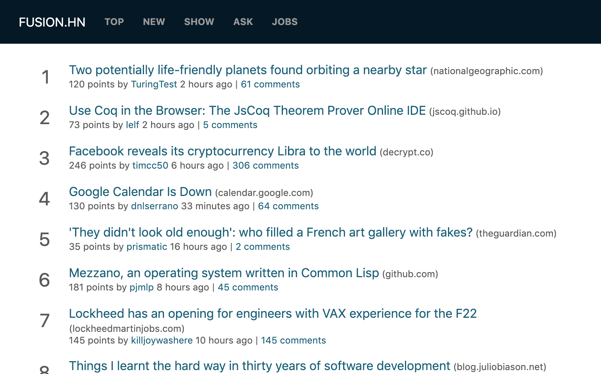
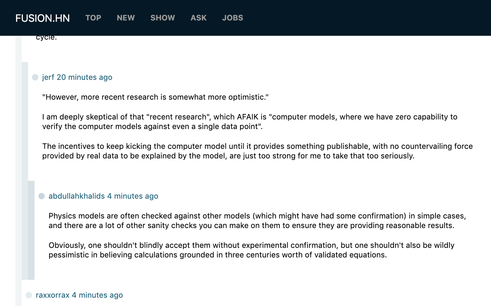

# Fusion HN

A Hacker News client built with Uber's [Fusion.js](https://fusionjs.com).





## Performance
- Lighthouse [93/100](https://www.webpagetest.org/lighthouse.php?test=190617_TS_90973ca8d7a8b1044a45c584c7682002&run=3)
- Emerging Markets Slow 3G TTI [3.5s](https://www.webpagetest.org/result/190617_M0_a692f752eefbdfff4217fc6a47c40fbf/)
- Regular 3G TTI [3.5s](https://www.webpagetest.org/result/190617_TS_90973ca8d7a8b1044a45c584c7682002/)

## Features
- PWA support via `fusion-plugin-service-worker` + `fusion-plugin-web-app-manifest`
- "Realtime" updates via 60s GraphQL polling interval
- Supports displays of comment threads

## Build + Set up
1. Install dependencies
    ```
    yarn / npm i
    ```
2. Run dev server or prod server
    ```
    yarn dev / yarn start
    ```

## License
MIT